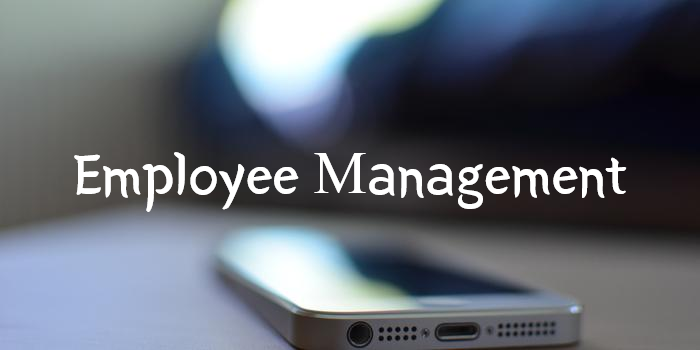
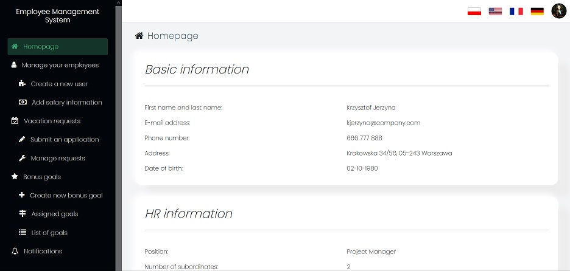
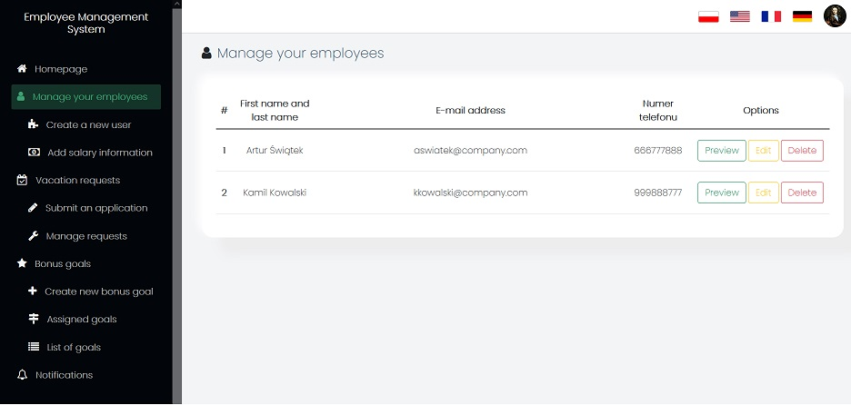
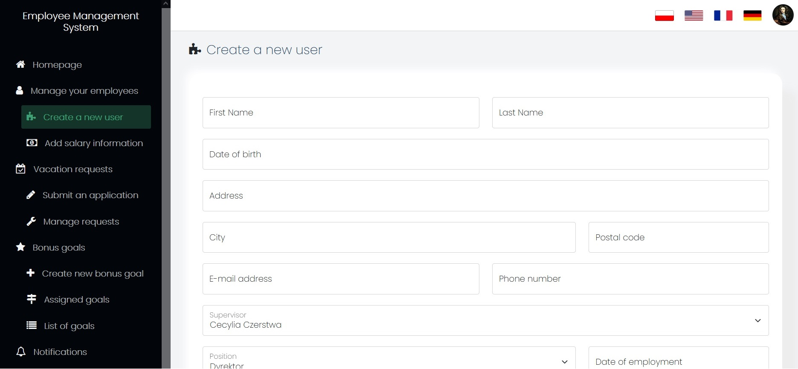
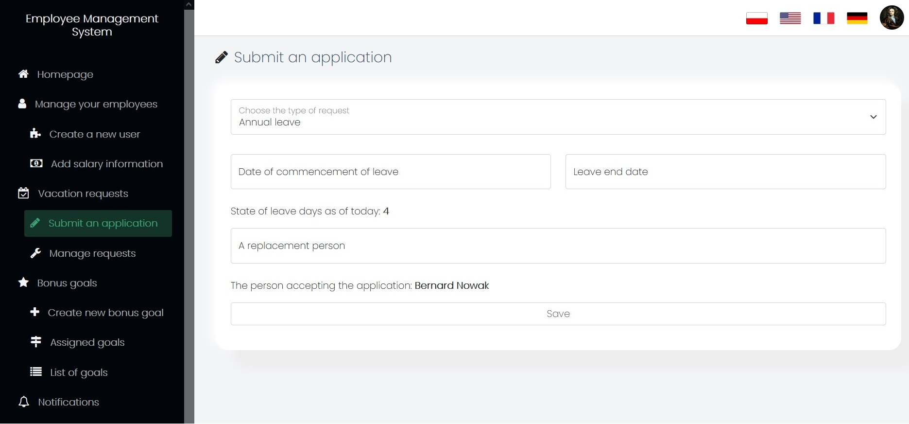
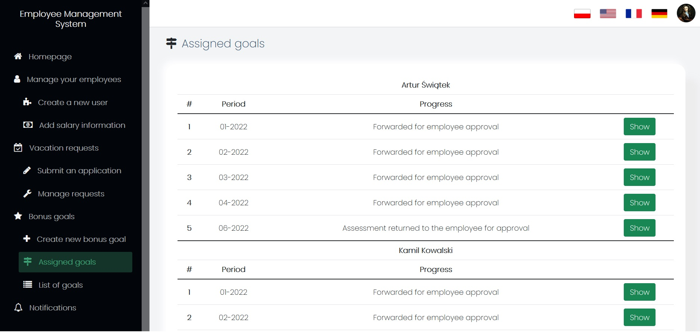

<h1 align="center">
  <br>
    </a>
  <br>
</h1>

# Employee Management System
> The application is designed to help in managing employees in corporations as well as medium and small companies.
<!--  Live demo [_here_](https://first-app-mayby.herokuapp.com/login). --> <!-- If you have the project hosted somewhere, include the link here. -->

## Table of Contents
* [General Info](#general-information)
* [Technologies Used](#technologies-used)
* [Features](#features)
* [Screenshots](#screenshots)
  * [Homepage](#homepage)
  * [Manage your employees](#manage-your-employees)
  * [Create new user](#create-new-user)
  * [Submit a vacation application](#submit-a-vacation-application)
  * [Assigned bonus goals](#assigned-bonus-goals)
* [Setup](#setup)
* [Project Status](#project-status)
* [Ideas](#ideas)
  * [Room for Improvement](#room-for-improvement)
  * [To do](#to-do)
* [License](#license) 


## General Information
- This project unifies and brings together in one place the most important information about the employee (his personal data, information on wages, vacation applications, etc.) as well as the company's expectations or bonus goals.
- The purpose of this application is to help in the efficient management of employees in the company.
- I undertook to write this application in order to improve my skills in working with the Symfony framework and getting to know it better and better.


## Technologies Used
- Symfony - version 5.3.14
- PHP - version 7.2.5/8.0
- Twig - version 3.3.8
- JavaScript/JQuery
- AJAX


## Features
List the ready features here:
- Adding / editing / removing employees
- Adding information about wages
- Adding as well as managing vacation requests
- Creating new business goals
- Assigning them to specific positions
- Editing / deleting business goals
- A multi-stage acceptance of goals
  - Creation a goal and assignment to a given position
  - Approval / rejection by the employee with the addition of an optional comment
  - Summary of the goal achievement level/resending the revised business goals card
  - Acceptance/rejection of the assessed card of business goals
- Notification panel (notifications sent with actions related to goal cards or vacation requests)
- Forcing a password change at the first login
- Translation into four different languages:
  - Polish
  - English
  - German
  - French

## Screenshots
>Disclaimer: These screenshots show the appearance of the application in 'supervisor mode'. 
> 
>The employee does not have access to many of the following functionalities. He can perform basic activities such as submitting a vacation request, accepting or rejecting business goals, accepting or rejecting the summary of meeting goals or reading notifications.
### Homepage

 

### Manage your employees
 

### Create new user


### Submit a vacation application


### Assigned bonus goals


## Setup
Project requirements/dependencies are located in _composer.json_ file in the root of the repository.

To set up local environment and get started with the project you first need to install and set up the symfony framework.
To do so follow the instructions avaliable [_here_](https://symfony.com/doc/5.4/setup.html#technical-requirements).

Then clone the repository to a folder and update composer dependencies.

```
  git clone https://github.com/GordonSX/employee_management.git
  cd employee_management
  composer update
```

Then set up a database, change the _DATABASE_URL_ in _.env_ file (uncomment one of the lines) and create schema.  
```
symfony console doctrine:schema:create
```

To populate database with user data start built-in Symfony server and go to route `127.0.0.1:8000/setup`

## Project Status
Project is: _in progress_ 

## Ideas
Some ideas for improvement and some functionalities to be added in the future:

### Room for improvement:
- Writing tests
- Better form validation
- Improving security
- Improving performance

### To do:
- Adding a calendar in the vacation request module and displaying employees' leaves in it (in order not to overlap)
- Adding a work schedule (also a calendar?)

## License
This project is open source and available under the [MIT License](License).